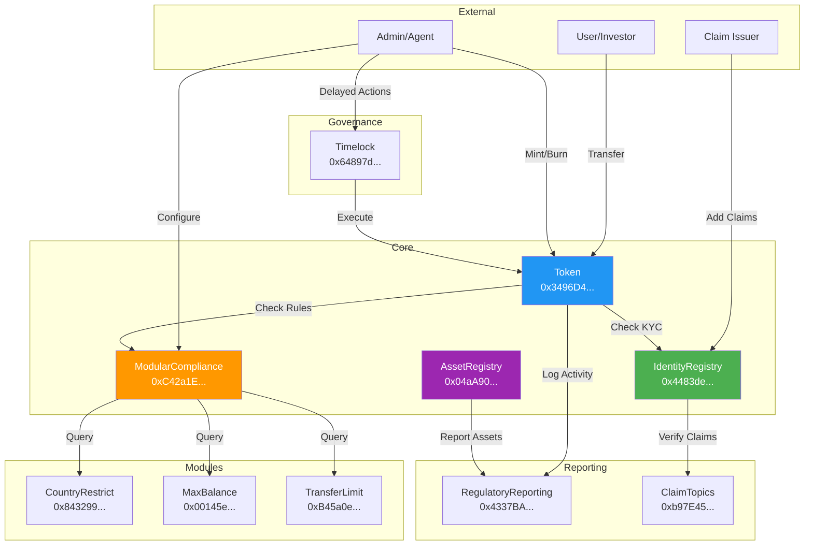

# Finatrades RWA Smart Contracts

## Table of Contents
- [Executive Summary](#executive-summary)
- [Architecture Overview](#architecture-overview)
- [Deployed Contracts](#deployed-contracts)
- [Contract Details](#contract-details)
- [Security Features](#security-features)
- [Integration Guide](#integration-guide)
- [Testing](#testing)
- [Audit Status](#audit-status)

## Executive Summary

**Finatrades** is pioneering the tokenization of Real World Assets (RWAs) through a comprehensive ERC-3643 compliant security token system. Our platform enables institutions to tokenize any asset class—from real estate and commodities to art and intellectual property—while maintaining full regulatory compliance.

### Key Features
- **ERC-3643 (T-REX) Compliant**: Full implementation of the Token for Regulated EXchanges standard
- **Multi-Asset Support**: Universal registry supporting any type of RWA
- **Modular Compliance**: Pluggable compliance modules for different jurisdictions
- **Identity Management**: On-chain KYC/AML with privacy preservation
- **Regulatory Reporting**: Automated compliance reporting and monitoring
- **Immutable Audit Trail**: Comprehensive compliance action tracking
- **Upgradeability**: UUPS proxy pattern for future enhancements
- **Cross-Chain Ready**: Optional Chainlink CCIP integration for multi-chain deployments (not required for single-chain compliance)

### Technical Stack
- **Blockchain**: Polygon Mainnet (Chain ID: 137)
- **Solidity Version**: 0.8.19
- **Framework**: Hardhat
- **Standards**: ERC-3643, ERC-20, ERC-1967 (UUPS)
- **Dependencies**: OpenZeppelin 4.9.0

## Architecture Overview

### System Architecture
```
┌─────────────────────────────────────────────────────────────────────────────┐
│                           Finatrades RWA Ecosystem                           │
└─────────────────────────────────────────────────────────────────────────────┘
                                        │
        ┌───────────────────────────────┴────────────────────────────────┐
        │                                                                 │
┌───────▼──────────┐                                          ┌──────────▼─────────┐
│  Security Token  │                                          │   Asset Registry   │
│  (ERC-3643)      │◄─────────────────────────────────────────┤   (Universal RWA)  │
└──────┬───────────┘                                          └────────────────────┘
       │                                                                 
       ├──────────────┬────────────────┬─────────────────┬──────────────┐
       │              │                │                 │              │
┌──────▼──────┐ ┌─────▼──────┐ ┌──────▼──────┐ ┌───────▼──────┐ ┌─────▼───────┐
│  Identity    │ │ Compliance │ │  Modules    │ │  Regulatory  │ │  Timelock   │
│  Registry    │ │  Engine    │ │  (3 Types) │ │  Reporting   │ │  Governance │
└─────────────┘ └────────────┘ └─────────────┘ └──────────────┘ └─────────────┘
```

### Token Transfer Flow (Mermaid)


### Contract Interaction Flow (Mermaid)


## Regulatory Compliance Approach

### Single-Chain Compliance (Current Deployment)
The deployed contracts provide **complete regulatory compliance** for RWA tokenization on Polygon:

- **KYC/AML Verification**: All token holders must pass identity verification through the IdentityRegistry
- **Jurisdiction Controls**: Country restrictions ensure compliance with local regulations
- **Transfer Restrictions**: Balance limits and transfer limits prevent market manipulation
- **Audit Trail**: All transfers and compliance violations are recorded on-chain
- **Regulatory Reporting**: Automated generation of compliance reports for regulators

**Note**: CCIP (Cross-Chain Interoperability Protocol) is NOT required for regulatory compliance on a single blockchain. The current deployment on Polygon provides all necessary regulatory features for compliant RWA tokenization.

### Optional Cross-Chain Features
The codebase includes CCIP contracts for future multi-chain deployments:
- `CCIPRegulatoryBridge.sol` - For cross-chain compliance synchronization
- `CCIPIdentityReceiver.sol` - For receiving KYC data from other chains
- `RegulatoryIdentityRegistry.sol` - For multi-chain identity management
- `RegulatoryAuditTrail.sol` - For cross-chain audit trails

These contracts are **not deployed** as they are only needed when operating across multiple blockchains.

## Deployed Contracts

### Polygon Mainnet Deployment (December 2025)

#### Main Contracts (Proxy Addresses)

| Contract | Proxy Address | Implementation | Purpose |
|----------|---------------|----------------|---------|
| **Token** | [`0x3496D447c773905B5CA3B29DA1ca7c42510596B3`](https://polygonscan.com/address/0x3496D447c773905B5CA3B29DA1ca7c42510596B3) | [`0x2BD4EA5353dAC5d7e17FC149d267Fc2174A89594`](https://polygonscan.com/address/0x2BD4EA5353dAC5d7e17FC149d267Fc2174A89594) | ERC-3643 Security Token |
| **IdentityRegistry** | [`0x4483de4257Ca47E02E7862452d6E08690c6827fd`](https://polygonscan.com/address/0x4483de4257Ca47E02E7862452d6E08690c6827fd) | [`0x2e469Ff181dbBfFB86957dADBdfe948DCe2f843b`](https://polygonscan.com/address/0x2e469Ff181dbBfFB86957dADBdfe948DCe2f843b) | KYC/Identity Management |
| **ModularCompliance** | [`0xC42a1E382ef2C36d8D4bEE654fB877e2E9b1Eb8a`](https://polygonscan.com/address/0xC42a1E382ef2C36d8D4bEE654fB877e2E9b1Eb8a) | [`0x2F52feE580053e641009fEBaf22484CA495C0938`](https://polygonscan.com/address/0x2F52feE580053e641009fEBaf22484CA495C0938) | Compliance Orchestration |
| **AssetRegistry** | [`0x04aA90cAaAc423a5a1A858EE863482cAFd0fEb5F`](https://polygonscan.com/address/0x04aA90cAaAc423a5a1A858EE863482cAFd0fEb5F) | [`0xef98aC203A72796Bd9f764dDc4D78c4568094252`](https://polygonscan.com/address/0xef98aC203A72796Bd9f764dDc4D78c4568094252) | RWA Asset Management |
| **RegulatoryReportingOptimized** | [`0x4337BA0627DA5649736447Ce49Ed65315dD74E47`](https://polygonscan.com/address/0x4337BA0627DA5649736447Ce49Ed65315dD74E47) | [`0x15B00D40A30A8FA0BB432fA780595fD820620255`](https://polygonscan.com/address/0x15B00D40A30A8FA0BB432fA780595fD820620255) | Compliance Reporting |

#### Supporting Contracts

| Contract | Proxy Address | Implementation | Purpose |
|----------|---------------|----------------|---------|
| **ClaimTopicsRegistry** | [`0xb97E45F808369C0629667B1eCD67d7cB31755110`](https://polygonscan.com/address/0xb97E45F808369C0629667B1eCD67d7cB31755110) | [`0x769015E394fD7AeDff895eEb1C12a88038e2B843`](https://polygonscan.com/address/0x769015E394fD7AeDff895eEb1C12a88038e2B843) | Identity Claim Topics |
| **CountryRestrictModule** | [`0x843299F60C3D07562e23bF3e7C5481edEC9c8DD9`](https://polygonscan.com/address/0x843299F60C3D07562e23bF3e7C5481edEC9c8DD9) | [`0x3Df52370727F84B4f7384bF1cbEB253F01Bbf82a`](https://polygonscan.com/address/0x3Df52370727F84B4f7384bF1cbEB253F01Bbf82a) | Geographic Restrictions |
| **MaxBalanceModule** | [`0x00145e3a2897a1110632562EC469B2434841C009`](https://polygonscan.com/address/0x00145e3a2897a1110632562EC469B2434841C009) | [`0xa60820B239f3423ed08D61D9bF937AB45F0C5C3B`](https://polygonscan.com/address/0xa60820B239f3423ed08D61D9bF937AB45F0C5C3B) | Balance Limits |
| **TransferLimitModule** | [`0xB45a0eB5c79aEFD7185f246CA9a2397AaF3Ea5Ae`](https://polygonscan.com/address/0xB45a0eB5c79aEFD7185f246CA9a2397AaF3Ea5Ae) | [`0x59e1aC8be18b4CD7792Fc0bAF4dC279D8a4aa2BB`](https://polygonscan.com/address/0x59e1aC8be18b4CD7792Fc0bAF4dC279D8a4aa2BB) | Transfer Limits |
| **FinatradesTimelock** | [`0x64897d31E7A90CF5166d85B039340122D2e1B72e`](https://polygonscan.com/address/0x64897d31E7A90CF5166d85B039340122D2e1B72e) | N/A (Non-upgradeable) | 48-hour Governance Delay |

### Deployment Information
- **Network**: Polygon Mainnet (Chain ID: 137)
- **Deployer**: `0xCE982AC6bc316Cf9d875652B84C7626B62a899eA`
- **Deployment Date**: December 3, 2025
- **Token Name**: Finatrades RWA Token
- **Token Symbol**: FRWA
- **Token Decimals**: 18

## Contract Details

### 1. Token (ERC-3643 Security Token)

The base ERC-3643 compliant security token implementing the T-REX standard.

**Key Functions**:
```solidity
transfer(address to, uint256 amount) // Compliance-checked transfer
mint(address account, uint256 amount) // Restricted minting
burn(address account, uint256 amount) // Token burning
freeze(address account) // Freeze investor account
pause() / unpause() // Emergency pause functionality
setIdentityRegistry(address _identityRegistry) // Update identity registry
setCompliance(address _compliance) // Update compliance contract
recoveryAddress(address lostWallet, address newWallet) // Recover lost tokens
```

**Access Control Roles**:
- `DEFAULT_ADMIN_ROLE`: Full administrative control
- `AGENT_ROLE`: Mint, burn, freeze operations
- `OWNER_ROLE`: Contract configuration

### 2. IdentityRegistry

Manages on-chain identities and KYC verification.

**Key Functions**:
```solidity
registerIdentity(address _userAddress, address _identity, uint16 _country)
updateIdentity(address _userAddress, address _identity)
updateCountry(address _userAddress, uint16 _country)
deleteIdentity(address _userAddress)
isVerified(address _userAddress) returns (bool)
batchRegisterIdentity(address[] _userAddresses, address[] _identities, uint16[] _countries)
```

### 3. ModularCompliance

Orchestrates compliance rules through pluggable modules.

**Key Functions**:
```solidity
bindToken(address _token)
addModule(address _module)
removeModule(address _module)
canTransfer(address _from, address _to, uint256 _amount) returns (bool)
transferred(address _from, address _to, uint256 _amount)
getModules() returns (address[])
```

### 4. AssetRegistry

Universal registry for any type of Real World Asset.

**Key Functions**:
```solidity
registerAsset(bytes32 assetId, string name, AssetCategory category, uint256 valuation, string metadataURI, address custodian)
updateAssetValuation(bytes32 assetId, uint256 newValuation, string source)
setAssetStatus(bytes32 assetId, AssetStatus status)
createRevenueStream(bytes32 assetId, uint256 amount, uint256 frequency, address collector)
```

**Asset Categories**:
- REAL_ESTATE (0)
- COMMODITIES (1)
- ART_COLLECTIBLES (2)
- INTELLECTUAL_PROPERTY (3)
- FINANCIAL_INSTRUMENTS (4)
- INFRASTRUCTURE (5)
- NATURAL_RESOURCES (6)
- OTHER (7)

### 5. Compliance Modules

#### CountryRestrictModule
```solidity
addCountryRestriction(uint16 _country)
removeCountryRestriction(uint16 _country)
batchRestrictCountries(uint16[] _countries)
```

#### MaxBalanceModule
```solidity
setDefaultMaxBalance(uint256 _defaultMax)
setMaxBalance(address _user, uint256 _max)
batchSetMaxBalance(address[] _users, uint256[] _maxBalances)
```

#### TransferLimitModule
```solidity
setDefaultLimits(uint256 _dailyLimit, uint256 _monthlyLimit)
setTransferLimit(address _user, uint256 _dailyLimit, uint256 _monthlyLimit)
```

### 6. RegulatoryReportingOptimized

Automated regulatory reporting and compliance monitoring.

**Key Functions**:
```solidity
recordTransaction(address from, address to, uint256 amount, string assetId, bool wasCompliant)
recordComplianceViolation(address violator, address counterparty, uint256 attemptedAmount, string reason, string action)
getHolderCount() returns (uint256)
getHolderList(uint256 offset, uint256 limit) returns (address[])
generateComplianceReport() returns (bytes)
```

## Security Features

### Access Control
- Role-based access control (RBAC) with granular permissions
- Multi-signature capability through timelock
- Emergency pause functionality
- Token recovery mechanisms

### Compliance
- Real-time compliance checking
- Modular compliance rules
- Jurisdiction-based restrictions
- Transfer limits and balance caps

### Audit Trail
- Immutable transaction history
- Compliance violation tracking
- Regulatory reporting integration
- On-chain identity verification

## Integration Guide

### 1. Setting Up Identity (KYC/AML)

```javascript
// Deploy identity contract for investor
const Identity = await ethers.getContractFactory("Identity");
const identity = await Identity.deploy(investorAddress, true);

// Register in IdentityRegistry
await identityRegistry.registerIdentity(
    investorAddress,
    identity.address,
    840 // USA country code
);

// Add KYC claim
await identity.addClaim(
    7, // KYC claim topic
    1, // Scheme
    issuerAddress,
    signature,
    data,
    uri
);
```

### 2. Minting Tokens

```javascript
// Only AGENT_ROLE can mint
await token.mint(investorAddress, ethers.parseEther("1000"));
```

### 3. Asset Registration

```javascript
// Register asset
const assetId = ethers.id("PROPERTY-001");
await assetRegistry.registerAsset(
    assetId,
    "Manhattan Commercial Building",
    0, // REAL_ESTATE
    ethers.parseEther("1000000"), // $1M valuation
    "ipfs://QmAssetMetadata",
    custodianAddress
);
```

## Testing

### Security Test Suite
```bash
# Run all security tests
npx hardhat test test/security/*.test.js

# Run specific test categories
npx hardhat test test/security/AccessControl.test.js
npx hardhat test test/security/ReentrancyGuard.test.js
npx hardhat test test/security/EdgeCases.test.js
npx hardhat test test/security/Invariants.test.js
npx hardhat test test/security/OverflowUnderflow.test.js
```

### Coverage
```bash
npx hardhat coverage
```

## Audit Status

- **Status**: Ready for audit
- **Security Tests**: Comprehensive test suite included
- **Known Issues**: None
- **Last Review**: December 2025

## Support

- **Technical Support**: blockchain@finatrades.com
- **Security Contact**: security@finatrades.com
- **Website**: https://finatrades.com

## License

MIT License - Copyright (c) 2025 Finatrades

---

**Version**: 2.0.0  
**Last Updated**: December 3, 2025