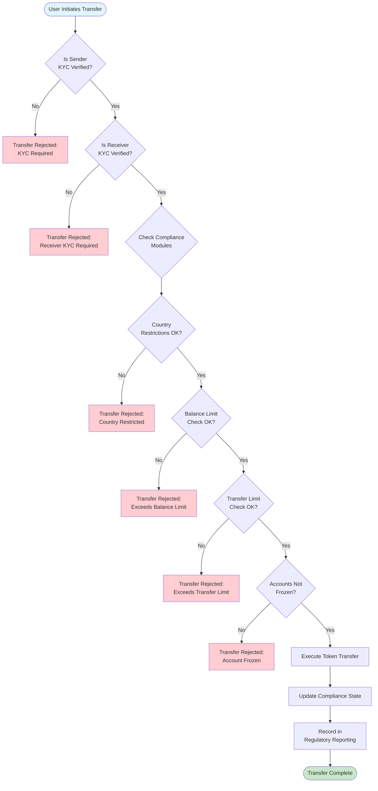
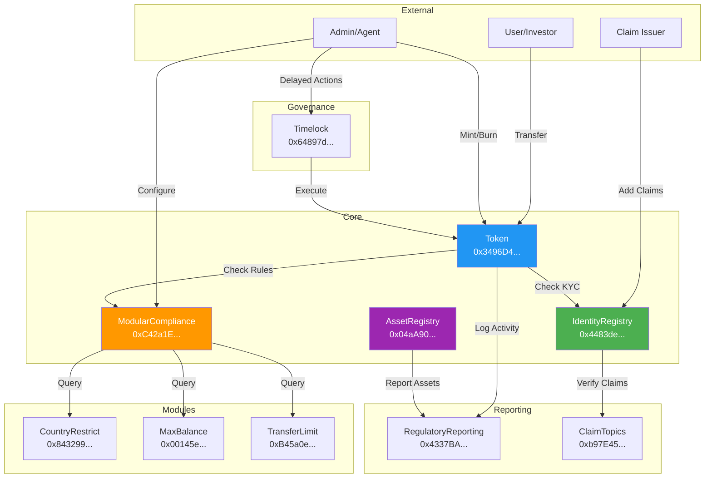

# Finatrades RWA Smart Contracts

## Table of Contents
- [Executive Summary](#executive-summary)
- [Architecture Overview](#architecture-overview)
- [Token Selection Guide](#token-selection-guide)
- [Deployed Contracts](#deployed-contracts)
- [Contract Details](#contract-details)
- [KYC and Country Restrictions](#kyc-and-country-restrictions)
- [Token Control Mechanisms](#token-control-mechanisms)
- [Security Features](#security-features)
- [Integration Guide](#integration-guide)
- [Testing](#testing)
- [Audit Status](#audit-status)

## Executive Summary

**Finatrades** is pioneering the tokenization of Real World Assets (RWAs) through a comprehensive ERC-3643 compliant security token system. Our platform enables institutions to tokenize any asset class—from real estate and commodities to art and intellectual property—while maintaining full regulatory compliance.

### Key Features
- **ERC-3643 (T-REX) Compliant**: Full implementation of the Token for Regulated EXchanges standard
- **Multi-Asset Support**: Universal registry supporting any type of RWA
- **Flexible Token Standards**: Choose between ERC-20 (fractional), ERC-721 (NFT), or ERC-1155 (multi-ownership-token) for each asset
- **Token Factory**: Automated deployment of compliant tokens with user-selected standard
- **Modular Compliance**: Pluggable compliance modules for different jurisdictions
- **Identity Management**: On-chain KYC/AML with privacy preservation
- **Regulatory Reporting**: Automated compliance reporting and monitoring
- **Immutable Audit Trail**: Comprehensive compliance action tracking
- **Upgradeability**: UUPS proxy pattern for future enhancements
- **Cross-Chain Ready**: Optional Chainlink CCIP integration for multi-chain deployments (not required for single-chain compliance)

### Technical Stack
- **Blockchain**: Polygon Mainnet (Chain ID: 137)
- **Solidity Version**: 0.8.19
- **Framework**: Hardhat
- **Standards**: ERC-3643, ERC-20, ERC-1967 (UUPS)
- **Dependencies**: OpenZeppelin 4.9.0

## Architecture Overview

### System Architecture
```
┌─────────────────────────────────────────────────────────────────────────────┐
│                     Finatrades RWA Ecosystem (Deployed)                      │
└─────────────────────────────────────────────────────────────────────────────┘
                                        │
        ┌───────────────────────────────┴────────────────────────────────┐
        │                                                                 │
┌───────▼──────────┐                                          ┌──────────▼─────────┐
│  Token Factory   │                                          │   Asset Registry   │
│  (ERC-20/721/    │──────────────────────────────────────────┤   (Universal RWA)  │
│   1155 Deployer) │                                          └────────────────────┘
└──────┬───────────┘                                                     
       │ Deploys                                                          
┌──────▼──────────┐                                                      
│  Security Token │                                                      
│  (ERC-3643)     │                                                      
└──────┬──────────┘                                                      
       │                                                                 
       ├──────────────┬────────────────┬─────────────────┬──────────────┐
       │              │                │                 │              │
┌──────▼──────┐ ┌─────▼──────┐ ┌──────▼──────┐ ┌───────▼──────┐ ┌─────▼───────┐
│  Identity    │ │ Compliance │ │  Modules    │ │  Regulatory  │ │  Timelock   │
│  Registry    │ │  Engine    │ │  (3 Types) │ │  Reporting   │ │  Governance │
└─────────────┘ └────────────┘ └─────────────┘ └──────────────┘ └─────────────┘
```

### Token Transfer Flow (Mermaid)


### Contract Interaction Flow (Mermaid)


## Token Selection Guide

### When to Use ERC-20 (Fractional Tokens)

Choose ERC-20 tokens for assets that benefit from:
- **Fractional Ownership**: Multiple investors can own portions of the asset
- **High Liquidity**: Easier to trade on secondary markets
- **Lower Entry Barriers**: Investors can buy small amounts
- **Standardized Pricing**: All tokens have the same value

**Best for**: Real estate properties, commodity pools, investment funds, revenue-sharing agreements

### When to Use ERC-721 (NFTs)

Choose ERC-721 tokens for assets that are:
- **Unique and Indivisible**: Each asset is one-of-a-kind
- **Collector Items**: Value derived from uniqueness
- **Whole Ownership**: Single owner per asset
- **Distinct Metadata**: Each token has unique properties

**Best for**: Individual properties, art pieces, luxury items, unique collectibles, certificates

### When to Use ERC-1155 (Multi-Token)

Choose ERC-1155 tokens for assets that require:
- **Batch Management**: Multiple token types in one contract
- **Semi-Fungible Assets**: Combining fungible and non-fungible properties
- **Gas Efficiency**: Reduced transaction costs for batch operations
- **Flexible Supply**: Different supply amounts for different token IDs

**Best for**: Commodity batches, production runs, limited editions, tiered memberships, fractional NFTs

### Hybrid Approach

Some projects may use multiple standards:
- ERC-721 for the property deed (ownership)
- ERC-20 for revenue sharing tokens
- ERC-1155 for batch management of similar assets
- Multiple asset types in one ecosystem

## Deploying ERC-1155 Tokens

### Using the Factory (Recommended)

The ERC-1155 implementation is now fully integrated with the FinatradesTokenFactory. To deploy an ERC-1155 token:

```javascript
// 1. First, register your asset in the AssetRegistry
const assetId = ethers.keccak256(ethers.toUtf8Bytes("GOLD-BATCH-2025"));
await assetRegistry.registerAsset(
    assetId,
    "Gold Batch Q1 2025",
    1, // AssetCategory.COMMODITY
    ethers.parseEther("1000000"), // valuationAmount
    "ipfs://metadata",
    custodianAddress
);

// 2. Deploy the ERC-1155 token via factory
const factory = await ethers.getContractAt(
    "FinatradesTokenFactory",
    "0xb0d5D0a17F8f6B31ED2D4ae11BD487872653FB08"
);

const tx = await factory.deployToken(
    2, // TokenType.ERC1155
    "Gold Batch Q1 2025",
    "GOLD2025", // Symbol (required by factory but not used by ERC-1155)
    assetId,
    adminAddress
);

const receipt = await tx.wait();
// Extract token address from event

// 3. Create batches and mint tokens
const multiToken = await ethers.getContractAt("FinatradesMultiTokenOptimized", tokenAddress);

await multiToken.createBatch(
    assetId,
    "Gold Batch Q1 2025",
    "100 ounces of gold, 99.9% purity",
    100000, // Total supply
    ethers.parseEther("50"), // Price per token
    "ipfs://batch-metadata"
);
```

### Key Features
- **Batch Creation**: Create multiple token types within one contract
- **Flexible Minting**: Mint to single or multiple recipients
- **Compliance Integration**: Full ERC-3643 compliance per batch
- **Gas Efficient**: Optimized for batch operations
- **Metadata Support**: Each batch can have unique metadata

## Regulatory Compliance Approach

### Single-Chain Compliance (Current Deployment)
The deployed contracts provide **complete regulatory compliance** for RWA tokenization on Polygon:

- **KYC/AML Verification**: All token holders must pass identity verification through the IdentityRegistry
- **Jurisdiction Controls**: Country restrictions ensure compliance with local regulations
- **Transfer Restrictions**: Balance limits and transfer limits prevent market manipulation
- **Audit Trail**: All transfers and compliance violations are recorded on-chain
- **Regulatory Reporting**: Automated generation of compliance reports for regulators

**Note**: CCIP (Cross-Chain Interoperability Protocol) is NOT required for regulatory compliance on a single blockchain. The current deployment on Polygon provides all necessary regulatory features for compliant RWA tokenization.

### Optional Cross-Chain Features
The codebase includes CCIP contracts for future multi-chain deployments:
- `CCIPRegulatoryBridge.sol` - For cross-chain compliance synchronization
- `CCIPIdentityReceiver.sol` - For receiving KYC data from other chains
- `RegulatoryIdentityRegistry.sol` - For multi-chain identity management
- `RegulatoryAuditTrail.sol` - For cross-chain audit trails

These contracts are **not deployed** as they are only needed when operating across multiple blockchains.

## Deployed Contracts

### Polygon Mainnet Deployment (August 27, 2025)

#### Main Contracts (Proxy Addresses)

| Contract | Proxy Address | Implementation | Purpose |
|----------|---------------|----------------|---------|
| **Token** | [`0xC07eE2C6D3C64a8562fd0D51BA1A4824dCD091ad`](https://polygonscan.com/address/0xC07eE2C6D3C64a8562fd0D51BA1A4824dCD091ad) | [`0x7559E7dABdD819dE1f6c35ae103980388D663969`](https://polygonscan.com/address/0x7559E7dABdD819dE1f6c35ae103980388D663969) | ERC-3643 Security Token |
| **IdentityRegistry** | [`0xe357e6065E17cD3D913E203D9E0A5ae2F7b258c6`](https://polygonscan.com/address/0xe357e6065E17cD3D913E203D9E0A5ae2F7b258c6) | [`0xf964DC2A2a597d95BFC227587652317ac4C21A27`](https://polygonscan.com/address/0xf964DC2A2a597d95BFC227587652317ac4C21A27) | KYC/Identity Management |
| **ModularCompliance** | [`0xb8a9b1F5Cf2D4F73502ACc08588125afBb7bCb4D`](https://polygonscan.com/address/0xb8a9b1F5Cf2D4F73502ACc08588125afBb7bCb4D) | [`0x425F899C1BE679505e10652E74d47cAdC8d826d1`](https://polygonscan.com/address/0x425F899C1BE679505e10652E74d47cAdC8d826d1) | Compliance Orchestration |
| **AssetRegistry** | [`0x83413e2C668c9249331Bc88D370655bb44527867`](https://polygonscan.com/address/0x83413e2C668c9249331Bc88D370655bb44527867) | [`0x144709AA5B52559ABe42Cb050B743B5C7c21Caa9`](https://polygonscan.com/address/0x144709AA5B52559ABe42Cb050B743B5C7c21Caa9) | RWA Asset Management |
| **RegulatoryReportingOptimized** | [`0xB7e2ca25f30662eABb0896053Ea5C76924983e62`](https://polygonscan.com/address/0xB7e2ca25f30662eABb0896053Ea5C76924983e62) | [`0x70E68dD058412B6c0554af11b8EfBA77661DDE1b`](https://polygonscan.com/address/0x70E68dD058412B6c0554af11b8EfBA77661DDE1b) | Compliance Reporting |

#### Supporting Contracts

| Contract | Proxy Address | Implementation | Purpose |
|----------|---------------|----------------|---------|
| **ClaimTopicsRegistry** | [`0x930835a2d966245ad6b69DA875C20FD3B74ADb3f`](https://polygonscan.com/address/0x930835a2d966245ad6b69DA875C20FD3B74ADb3f) | [`0xAF0f25ac810a13486354586E5ADF8FB4a83d8ADc`](https://polygonscan.com/address/0xAF0f25ac810a13486354586E5ADF8FB4a83d8ADc) | Identity Claim Topics |
| **IdentityFactory** | [`0xEc4321AC175D9bA6dE16337A49895fC9f2FEb85B`](https://polygonscan.com/address/0xEc4321AC175D9bA6dE16337A49895fC9f2FEb85B) | [`0x5f4489815c2C8438039deaCa9717cE33b8388528`](https://polygonscan.com/address/0x5f4489815c2C8438039deaCa9717cE33b8388528) | Factory for deploying Identity contracts |
| **CountryRestrictModule** | [`0x6F332F2dBc812b081B956d66ce0c5bFdad764e10`](https://polygonscan.com/address/0x6F332F2dBc812b081B956d66ce0c5bFdad764e10) | [`0x4A1d0a835B39Ac243141d0544285277af696e553`](https://polygonscan.com/address/0x4A1d0a835B39Ac243141d0544285277af696e553) | Geographic Restrictions ([ISO Country Codes](https://unstats.un.org/unsd/methodology/m49/)) |
| **MaxBalanceModule** | [`0x17BaBff4A2BeCB2C2b6182d28AD8e5E1b1087DEd`](https://polygonscan.com/address/0x17BaBff4A2BeCB2C2b6182d28AD8e5E1b1087DEd) | [`0xF33c98eD21BEBAf57A63ab841aF534768e828eBC`](https://polygonscan.com/address/0xF33c98eD21BEBAf57A63ab841aF534768e828eBC) | Balance Limits |
| **TransferLimitModule** | [`0x4b65BFd9301efc1084fA0757763538d4be1fDec3`](https://polygonscan.com/address/0x4b65BFd9301efc1084fA0757763538d4be1fDec3) | [`0x3aFAe6b42B23cb6566774232F5252520Da282B90`](https://polygonscan.com/address/0x3aFAe6b42B23cb6566774232F5252520Da282B90) | Transfer Limits |
| **FinatradesTimelock** | [`0xD9917515cdF619bBB1d6921a65966E757a41080f`](https://polygonscan.com/address/0xD9917515cdF619bBB1d6921a65966E757a41080f) | N/A (Non-upgradeable) | 48-hour Governance Delay |

#### Token Factory System (Updated: August 29, 2025)

| Contract | Address | Type | Purpose |
|----------|---------|------|---------|
| **FinatradesTokenFactory** | [`0x41e5A8eaf1bc00DEA2ad953497043337C39B9b36`](https://polygonscan.com/address/0x41e5A8eaf1bc00DEA2ad953497043337C39B9b36) | Proxy | Factory for deploying ERC-20, ERC-721, and ERC-1155 tokens (Latest - August 29, 2025) |
| **Factory Implementation** | [`0xA4376bC2A8eb152aaB901903059430832176925b`](https://polygonscan.com/address/0xA4376bC2A8eb152aaB901903059430832176925b) | Implementation | Latest implementation with improved error handling and ERC-1155 support (August 29, 2025) |

**Token Implementations (Ready for Deployment via Factory):**
- **ERC-20 Implementation**: [`0x54F99B4D75C4d9B62595ca8230e675dd75636467`](https://polygonscan.com/address/0x54F99B4D75C4d9B62595ca8230e675dd75636467) - For fractional ownership tokens
- **ERC-721 Implementation**: [`0x7DA038D58F4B80E8460dba41111cdA92Ac1aC772`](https://polygonscan.com/address/0x7DA038D58F4B80E8460dba41111cdA92Ac1aC772) - For unique asset NFTs
- **ERC-1155 Implementation**: [`0xCD5612DD14fF5d38c2853fA0eE801d5A3b669337`](https://polygonscan.com/address/0xCD5612DD14fF5d38c2853fA0eE801d5A3b669337) - For multi-token batch assets ✅
- **Compliance Implementation**: [`0xB3E1C557c7F21AB5b3391D3D5161762ab11FCabB`](https://polygonscan.com/address/0xB3E1C557c7F21AB5b3391D3D5161762ab11FCabB) - ModularCompliance for token compliance (Updated Dec 27, 2024)

### Deployment Information
- **Network**: Polygon Mainnet (Chain ID: 137)
- **Deployer**: `0xCE982AC6bc316Cf9d875652B84C7626B62a899eA`
- **Deployment Date**: August 27, 2025 (Complete fresh deployment)
- **Token Name**: Finatrades RWA Token
- **Token Symbol**: FRWA
- **Token Decimals**: 18

## Contract Details

### 1. Token (ERC-3643 Security Token)

The base ERC-3643 compliant security token implementing the T-REX standard.

**Key Functions**:
```solidity
transfer(address to, uint256 amount) // Compliance-checked transfer
mint(address account, uint256 amount) // Restricted minting
burn(address account, uint256 amount) // Token burning
freeze(address account) // Freeze investor account
pause() / unpause() // Emergency pause functionality
setIdentityRegistry(address _identityRegistry) // Update identity registry
setCompliance(address _compliance) // Update compliance contract
recoveryAddress(address lostWallet, address newWallet) // Recover lost tokens
```

**Access Control Roles**:
- `DEFAULT_ADMIN_ROLE`: Full administrative control
- `AGENT_ROLE`: Mint, burn, freeze operations
- `OWNER_ROLE`: Contract configuration

### 2. IdentityRegistry

Manages on-chain identities and KYC verification with integrated country restrictions. Countries can be blocked from submitting KYC, preventing registration from restricted jurisdictions.

**Key Functions**:
```solidity
registerIdentity(address _userAddress, address _identity, uint16 _country) // Checks if country is blocked
updateIdentity(address _userAddress, address _identity)
updateCountry(address _userAddress, uint16 _country) // Checks if new country is blocked
deleteIdentity(address _userAddress)
isVerified(address _userAddress) returns (bool)
batchRegisterIdentity(address[] _userAddresses, address[] _identities, uint16[] _countries)
setCountryBlocked(uint16 _country, bool _blocked) // Block/unblock countries from KYC
batchSetCountryRestrictions(uint16[] _countries, bool[] _blocked) // Batch country blocking
isCountryBlocked(uint16 _country) returns (bool) // Check if country is blocked
```

**Country Restriction Features**:
- **Pre-KYC Blocking**: Countries can be blocked before KYC submission
- **Registration Prevention**: Blocked countries cannot register identities
- **Update Protection**: Users cannot update to blocked countries
- **Batch Management**: Efficiently manage multiple country restrictions

### 3. ModularCompliance

Orchestrates compliance rules through pluggable modules.

**Key Functions**:
```solidity
bindToken(address _token)
addModule(address _module)
removeModule(address _module)
canTransfer(address _from, address _to, uint256 _amount) returns (bool)
transferred(address _from, address _to, uint256 _amount)
getModules() returns (address[])
```

### 4. AssetRegistry

Universal registry for any type of Real World Asset.

**Key Functions**:
```solidity
registerAsset(bytes32 assetId, string name, AssetCategory category, uint256 valuation, string metadataURI, address custodian)
updateAssetValuation(bytes32 assetId, uint256 newValuation, string source)
setAssetStatus(bytes32 assetId, AssetStatus status)
createRevenueStream(bytes32 assetId, uint256 amount, uint256 frequency, address collector)
```

**Asset Categories**:
- REAL_ESTATE (0)
- COMMODITIES (1)
- ART_COLLECTIBLES (2)
- INTELLECTUAL_PROPERTY (3)
- FINANCIAL_INSTRUMENTS (4)
- INFRASTRUCTURE (5)
- NATURAL_RESOURCES (6)
- OTHER (7)

### 5. Compliance Modules

#### CountryRestrictModule
```solidity
addCountryRestriction(uint16 _country)
removeCountryRestriction(uint16 _country)
batchRestrictCountries(uint16[] _countries)
```

#### MaxBalanceModule
```solidity
setDefaultMaxBalance(uint256 _defaultMax)
setMaxBalance(address _user, uint256 _max)
batchSetMaxBalance(address[] _users, uint256[] _maxBalances)
```

#### TransferLimitModule
```solidity
setDefaultLimits(uint256 _dailyLimit, uint256 _monthlyLimit)
setTransferLimit(address _user, uint256 _dailyLimit, uint256 _monthlyLimit)
```

### 6. RegulatoryReportingOptimized

Automated regulatory reporting and compliance monitoring.

**Key Functions**:
```solidity
recordTransaction(address from, address to, uint256 amount, string assetId, bool wasCompliant)
recordComplianceViolation(address violator, address counterparty, uint256 attemptedAmount, string reason, string action)
getHolderCount() returns (uint256)
getHolderList(uint256 offset, uint256 limit) returns (address[])
generateComplianceReport() returns (bytes)
```

### 7. IdentityFactory

Factory contract for deploying ERC-734/735 compliant Identity contracts.

**Key Functions**:
```solidity
deployIdentity(address _user, uint16 _country) // Deploy and register identity
deployIdentityWithClaim(address _user, uint16 _country, uint256 _claimTopic, bytes _claimData) // Deploy with initial claim
getIdentity(address _user) returns (address) // Get user's identity contract
isFactoryIdentity(address _identity) returns (bool) // Verify factory deployment
```

**Access Control Roles**:
- `DEFAULT_ADMIN_ROLE`: Full administrative control
- `IDENTITY_DEPLOYER_ROLE`: Can deploy identity contracts
- `UPGRADER_ROLE`: Can upgrade the factory contract

### 8. FinatradesTokenFactory

Factory contract for deploying Finatrades-branded ERC-20 or ERC-721 compliant security tokens based on user preference.

**Key Functions**:
```solidity
deployToken(TokenType _tokenType, string _name, string _symbol, bytes32 _assetId, address _tokenAdmin) // Deploy token
updateImplementation(TokenType _tokenType, address _newImplementation) // Update implementation
deactivateToken(address _tokenAddress) // Emergency deactivation
getTokenForAsset(bytes32 _assetId) returns (address) // Get token for asset
```

**Token Types**:
- `TokenType.ERC20 (0)`: Fractional ownership tokens using Finatrades Token contract
- `TokenType.ERC721 (1)`: Non-fungible tokens using FinatradesNFT contract
- `TokenType.ERC1155 (2)`: Multi-token batches using FinatradesMultiTokenOptimized contract

**Access Control Roles**:
- `FACTORY_ADMIN_ROLE`: Administrative control over factory
- `TOKEN_DEPLOYER_ROLE`: Can deploy new tokens
- `UPGRADER_ROLE`: Can upgrade the factory contract

### 9. FinatradesNFT

Finatrades-branded ERC-721 compliant security token for non-fungible real-world assets with full compliance integration.

**Key Functions**:
```solidity
mint(address _to, uint256 _value, bytes32 _assetId, string _uri) returns (uint256) // Mint NFT
```

### 10. FinatradesMultiTokenOptimized (ERC-1155)

Optimized ERC-1155 compliant multi-token standard for managing batches of real-world assets with full compliance integration.

**Key Functions**:
```solidity
createBatch(bytes32 _assetId, string _name, string _description, uint256 _totalSupply, uint256 _unitValue, string _metadataURI) // Create batch
mintBatch(uint256 _tokenId, address _to, uint256 _amount) // Mint from batch
mintBatchMultiple(uint256 _tokenId, address[] _recipients, uint256[] _amounts) // Batch mint to multiple
burnBatch(uint256 _tokenId, address _from, uint256 _amount) // Burn tokens
redeemTokens(uint256 _tokenId, uint256 _amount) // Redeem tokens
forcedTransfer(uint256 _tokenId, address _from, address _to, uint256 _amount) // Compliance transfer
freezeBatch(uint256 _tokenId, bool _freeze) // Freeze/unfreeze batch
freezeAddress(address _account, bool _freeze) // Freeze/unfreeze account
updateBatchMetadata(uint256 _tokenId, string _metadataURI) // Update metadata
updateBatchValue(uint256 _tokenId, uint256 _newUnitValue) // Update value
getOwnershipDistribution(uint256 _tokenId, uint256 _offset, uint256 _limit) // Get holders
getTotalValue(address _holder) // Get total value for holder
```

**Access Control Roles**:
- `ADMIN_ROLE`: Administrative control
- `AGENT_ROLE`: Can mint, burn, freeze, and force transfers

### 11. Token Features
- Full ERC-3643 compliance checks on transfers
- Value tracking for each NFT
- Asset ID association
- Metadata URI support
- Batch minting capabilities

## KYC and Country Restrictions

### Integrated KYC Country Blocking

The Finatrades platform implements **country restrictions at the KYC level**, preventing users from restricted jurisdictions from even registering their identity. This provides the first line of defense before any token operations.

#### How It Works

```
┌─────────────────────────────────────────────────────────────┐
│                 KYC COUNTRY RESTRICTION FLOW                 │
├─────────────────────────────────────────────────────────────┤
│  1. Admin blocks country (e.g., USA = 1)                    │
│     └── identityRegistry.setCountryBlocked(1, true)         │
│                                                              │
│  2. User from USA attempts KYC                              │
│     └── registerIdentity(user, identity, 1)                 │
│         └── ❌ REJECTED: "Country is blocked from KYC"      │
│                                                              │
│  3. User cannot:                                             │
│     └── Register identity                                   │
│     └── Update to blocked country                           │
│     └── Access any token operations                         │
└─────────────────────────────────────────────────────────────┘
```

#### Country Code Examples

| Country | Code | Usage |
|---------|------|-------|
| United States | 1 | `setCountryBlocked(1, true)` |
| China | 86 | `setCountryBlocked(86, true)` |
| Russia | 7 | `setCountryBlocked(7, true)` |
| United Kingdom | 44 | `setCountryBlocked(44, false)` |
| Germany | 49 | `setCountryBlocked(49, false)` |
| Japan | 81 | `setCountryBlocked(81, false)` |

#### Managing Country Restrictions

**Block a Single Country:**
```solidity
// Block USA from KYC registration
identityRegistry.setCountryBlocked(1, true);

// Unblock UK for KYC registration
identityRegistry.setCountryBlocked(44, false);
```

**Batch Block Multiple Countries:**
```solidity
// Block USA (1), China (86), and Russia (7)
uint16[] memory countries = [1, 86, 7];
bool[] memory blocked = [true, true, true];
identityRegistry.batchSetCountryRestrictions(countries, blocked);
```

**Check if Country is Blocked:**
```solidity
bool isUSABlocked = identityRegistry.isCountryBlocked(1);
```

#### Two-Layer Protection System

1. **KYC Layer (IdentityRegistry)** - *Prevents registration*
   - Blocks countries from submitting KYC
   - Prevents identity registration
   - Stops country updates to blocked jurisdictions

2. **Transfer Layer (CountryRestrictModule)** - *Controls transfers*
   - Additional transfer restrictions between countries
   - Can block specific country pairs
   - Operates on already KYC'd users

#### Common Use Cases

**Regulatory Compliance:**
```solidity
// Block sanctioned countries
identityRegistry.setCountryBlocked(NORTH_KOREA_CODE, true);
identityRegistry.setCountryBlocked(IRAN_CODE, true);
```

**Phased Market Entry:**
```solidity
// Start with EU countries only
// Block all non-EU countries initially
uint16[] memory nonEUCountries = [...];
bool[] memory allBlocked = [true, true, ...];
identityRegistry.batchSetCountryRestrictions(nonEUCountries, allBlocked);

// Later, open to specific markets
identityRegistry.setCountryBlocked(JAPAN_CODE, false);
identityRegistry.setCountryBlocked(SINGAPORE_CODE, false);
```

**Emergency Response:**
```solidity
// Quickly block a country due to regulatory changes
identityRegistry.setCountryBlocked(problematicCountryCode, true);
// All new KYC attempts from that country will be rejected immediately
```

### Access Control for Country Restrictions

- **OWNER_ROLE**: Can set country blocks and restrictions
- **AGENT_ROLE**: Can register identities (but cannot override country blocks)
- **Users**: Cannot register if from blocked country

## Token Control Mechanisms

### Freeze & Pause Capabilities

All Finatrades token contracts (ERC-20, ERC-721, and ERC-1155) include comprehensive control mechanisms that can be toggled on/off for regulatory compliance and emergency situations.

#### ERC-20 Token Controls (FinatradesToken)

| Control Type | Functions | Description | Required Role |
|-------------|-----------|-------------|---------------|
| **Global Pause** | `pause()` / `unpause()` | Stops ALL token operations (mint, burn, transfer) | `AGENT_ROLE` |
| **Account Freeze** | `setAddressFrozen(address, bool)` | Freeze/unfreeze specific accounts completely | `AGENT_ROLE` |
| **Partial Token Freeze** | `freezePartialTokens(address, uint256)` / `unfreezePartialTokens()` | Freeze specific amount of tokens for an address | `AGENT_ROLE` |
| **Mint Control** | `mint(address, uint256)` | Controlled minting with compliance checks | `AGENT_ROLE` |
| **Burn Control** | `burn(address, uint256)` | Controlled burning with compliance updates | `AGENT_ROLE` |
| **Forced Transfer** | `forcedTransfer(address, address, uint256)` | Emergency transfer bypass for compliance | `AGENT_ROLE` |

**Status Check Functions:**
- `paused()` - Check if contract is paused
- `isFrozen(address)` - Check if account is frozen
- `getFrozenTokens(address)` - Check amount of frozen tokens

#### ERC-721 Token Controls (FinatradesNFT)

| Control Type | Functions | Description | Required Role |
|-------------|-----------|-------------|---------------|
| **Global Pause** | `pause()` / `unpause()` | Stops ALL NFT operations | `AGENT_ROLE` |
| **Account Freeze** | `setAddressFrozen(address, bool)` | Freeze/unfreeze specific accounts | `AGENT_ROLE` |
| **Individual NFT Freeze** | `freezeToken(uint256)` / `unfreezeToken(uint256)` | Freeze/unfreeze specific NFT tokens | `AGENT_ROLE` |
| **Mint Control** | `mint(address, uint256, bytes32, string)` | Controlled NFT minting | `AGENT_ROLE` |
| **Burn Control** | `burn(uint256)` | Controlled NFT burning | `AGENT_ROLE` |
| **Forced Transfer** | `forcedTransfer(address, address, uint256)` | Emergency NFT transfer | `AGENT_ROLE` |

**Status Check Functions:**
- `paused()` - Check if contract is paused
- `isFrozen(address)` - Check if account is frozen
- `isTokenFrozen(uint256)` - Check if specific NFT is frozen

#### ERC-1155 Token Controls (FinatradesMultiTokenOptimized)

| Control Type | Functions | Description | Required Role |
|-------------|-----------|-------------|---------------|
| **Global Pause** | `pause()` / `unpause()` | Stops ALL multi-token operations | `AGENT_ROLE` |
| **Account Freeze** | `freezeAddress(address, bool)` | Freeze/unfreeze specific accounts | `AGENT_ROLE` |
| **Batch Freeze** | `freezeBatch(uint256, bool)` | Freeze/unfreeze entire token batches | `AGENT_ROLE` |
| **Mint Control** | `mintBatch()` / `mintBatchMultiple()` | Controlled batch minting | `AGENT_ROLE` |
| **Burn Control** | `burnBatch()` / `redeemTokens()` | Controlled batch burning | `AGENT_ROLE` |
| **Forced Transfer** | `forcedTransfer(uint256, address, address, uint256)` | Emergency batch transfer | `AGENT_ROLE` |

**Status Check Functions:**
- `paused()` - Check if contract is paused
- `isAddressFrozen(address)` / `isFrozen(address)` - Check if account is frozen
- `isBatchFrozen(uint256)` - Check if token batch is frozen

### Control Hierarchy

```
┌─────────────────────────────────────────────────────────────┐
│                    CONTROL HIERARCHY                         │
├─────────────────────────────────────────────────────────────┤
│  1. Global Pause (Highest Priority)                         │
│     └── Stops ALL operations when activated                 │
│                                                              │
│  2. Account Freeze                                          │
│     └── Blocks specific addresses from all operations       │
│                                                              │
│  3. Token/Batch Specific Freeze                             │
│     └── ERC-721: Individual NFT freeze                      │
│     └── ERC-1155: Entire batch freeze                       │
│     └── ERC-20: Partial amount freeze                       │
│                                                              │
│  4. Compliance Rules (Always Active)                        │
│     └── KYC/AML verification                                │
│     └── Country restrictions                                │
│     └── Balance limits                                      │
│     └── Transfer limits                                     │
└─────────────────────────────────────────────────────────────┘
```

### Usage Examples

#### Pausing All Operations
```solidity
// Pause all token operations (emergency stop)
token.pause();

// Resume normal operations
token.unpause();
```

#### Freezing Specific Accounts
```solidity
// Freeze a suspicious account
token.setAddressFrozen(suspiciousAddress, true);

// Unfreeze after investigation
token.setAddressFrozen(suspiciousAddress, false);
```

#### Freezing Specific Assets
```solidity
// ERC-721: Freeze specific NFT
nftToken.freezeToken(tokenId);

// ERC-1155: Freeze entire batch
multiToken.freezeBatch(batchId, true);

// ERC-20: Freeze partial balance
token.freezePartialTokens(address, amount);
```

### Emergency Procedures

1. **Global Emergency Stop**: Use `pause()` to immediately halt all operations
2. **Account Investigation**: Use `setAddressFrozen()` to freeze suspicious accounts
3. **Asset Recovery**: Use `forcedTransfer()` for court-ordered transfers
4. **Gradual Unfreezing**: Unfreeze accounts/tokens individually after review

### Role Management

- **AGENT_ROLE**: Operational control (pause, freeze, mint, burn, force transfers)
- **ADMIN_ROLE**: Administrative control and configuration
- **DEFAULT_ADMIN_ROLE**: Role management and critical functions

To grant roles:
```solidity
token.grantRole(AGENT_ROLE, newAgentAddress);
token.revokeRole(AGENT_ROLE, oldAgentAddress);
```

## Security Features

### Access Control
- Role-based access control (RBAC) with granular permissions
- Multi-signature capability through timelock
- Emergency pause functionality
- Token recovery mechanisms

### Compliance
- Real-time compliance checking
- Modular compliance rules
- Jurisdiction-based restrictions
- Transfer limits and balance caps

### Audit Trail
- Immutable transaction history
- Compliance violation tracking
- Regulatory reporting integration
- On-chain identity verification

## Integration Guide

### 1. Setting Up Identity (KYC/AML)

#### Option A: Using IdentityFactory (Recommended)

```javascript
// Deploy identity using factory (automatic registration)
const tx = await identityFactory.deployIdentity(
    investorAddress,
    840 // USA country code
);
const receipt = await tx.wait();

// Get the deployed identity address
const identityAddress = await identityFactory.getIdentity(investorAddress);

// Add KYC claim to the identity
const identity = await ethers.getContractAt("Identity", identityAddress);
await identity.addClaim(
    7, // KYC claim topic
    1, // Scheme
    issuerAddress,
    signature,
    data,
    uri
);
```

#### Option B: Manual Deployment

```javascript
// Deploy identity contract for investor
const Identity = await ethers.getContractFactory("Identity");
const identity = await Identity.deploy(investorAddress, false);

// Register in IdentityRegistry
await identityRegistry.registerIdentity(
    investorAddress,
    identity.address,
    840 // USA country code
);
```

### 2. Minting Tokens

```javascript
// Only AGENT_ROLE can mint
await token.mint(investorAddress, ethers.parseEther("1000"));
```

### 3. Asset Registration

```javascript
// Register asset
const assetId = ethers.id("PROPERTY-001");
await assetRegistry.registerAsset(
    assetId,
    "Manhattan Commercial Building",
    0, // REAL_ESTATE
    ethers.parseEther("1000000"), // $1M valuation
    "ipfs://QmAssetMetadata",
    custodianAddress
);
```

### 4. Token Deployment via Factory

The TokenFactory allows users to choose between ERC-20 and ERC-721 tokens for their assets:

#### Deploy ERC-20 Token (Fractional Ownership)

```javascript
// For assets that need fractional ownership
const FACTORY_ADDRESS = "0x5aC1EB4BE5D56D0d0b37ac21E3A2362d028F7A70";
const tokenFactory = await ethers.getContractAt("FinatradesTokenFactory", FACTORY_ADDRESS);

// Deploy ERC-20 token
const tx = await tokenFactory.deployToken(
    0, // TokenType.ERC20
    "Manhattan Office Building Token",
    "MOB",
    assetId,
    adminAddress
);

const receipt = await tx.wait();
const tokenAddress = receipt.events.find(e => e.event === "TokenDeployed").args.tokenAddress;

// Mint tokens to investors
const token = await ethers.getContractAt("Token", tokenAddress);
await token.mint(investorAddress, ethers.parseEther("1000"));
```

#### Deploy ERC-721 Token (Unique Assets)

```javascript
// For unique, non-divisible assets
const artAssetId = ethers.id("ART-PICASSO-001");

// Register art asset first
await assetRegistry.registerAsset(
    artAssetId,
    "Picasso Blue Period Original",
    2, // ART_COLLECTIBLES
    ethers.parseEther("50000000"), // $50M
    "ipfs://QmArtMetadata",
    custodianAddress
);

// Deploy ERC-721 token
const tx = await tokenFactory.deployToken(
    1, // TokenType.ERC721
    "Picasso Collection",
    "PBC",
    artAssetId,
    adminAddress
);

const receipt = await tx.wait();
const nftAddress = receipt.events.find(e => e.event === "TokenDeployed").args.tokenAddress;

// Mint NFT
const nftToken = await ethers.getContractAt("FinatradesNFT", nftAddress);
await nftToken.mint(
    collectorAddress,
    ethers.parseEther("50000000"), // Value
    artAssetId,
    "ipfs://QmNFTMetadata"
);
```

## Deployment Guide

### Prerequisites

1. Funded deployer wallet with MATIC on Polygon
2. Environment variables configured in `.env`:
   ```env
   PRIVATE_KEY=your_deployer_private_key
   POLYGONSCAN_API_KEY=your_polygonscan_api_key
   POLYGON_RPC_URL=https://polygon-rpc.com
   ```

### Deploying IdentityFactory

1. **Deploy the contract**:
   ```bash
   npx hardhat run scripts/deploy-identity-factory.js --network polygon
   ```

2. **Grant roles to backend wallet**:
   ```javascript
   const factory = await ethers.getContractAt("IdentityFactory", FACTORY_ADDRESS);
   const role = await factory.IDENTITY_DEPLOYER_ROLE();
   await factory.grantRole(role, "0xYourBackendWallet");
   ```

3. **Update environment configuration**:
   ```env
   NEXT_PUBLIC_IDENTITY_FACTORY_ADDRESS=0x3B44eb575E2971E967Ef979199c14Db795ba4156
   ```

### Backend Integration

Update your KYC approval flow to use IdentityFactory:

```javascript
import { deployIdentityForUser } from '@/lib/identity-factory';

// During KYC approval
if (!hasIdentity) {
  const { identityAddress, txHash } = await deployIdentityForUser(
    user.walletAddress,
    countryCode,
    factoryAddress,
    wallet
  );
  
  // Register the deployed identity
  await identityRegistry.registerIdentity(
    user.walletAddress,
    identityAddress, // Proper Identity contract
    countryCode
  );
}
```

### Gas Costs

- IdentityFactory deployment: ~3M gas
- Per user identity deployment: ~2.5M gas
- Total cost per user: ~$5-10 on Polygon

### JavaScript Library

The `identity-factory.js` library provides helper functions for web application integration:

```javascript
// Deploy identity for a user
const { identityAddress, txHash } = await deployIdentityForUser(
  userAddress,
  countryCode,
  factoryAddress,
  signer
);

// Check if user has an identity
const hasIdentity = await checkUserIdentity(userAddress, factoryAddress, provider);

// Get user's identity address
const identityAddress = await getUserIdentity(userAddress, factoryAddress, provider);
```

## Testing

### Security Test Suite
```bash
# Run all security tests
npx hardhat test test/security/*.test.js

# Run specific test categories
npx hardhat test test/security/AccessControl.test.js
npx hardhat test test/security/ReentrancyGuard.test.js
npx hardhat test test/security/EdgeCases.test.js
npx hardhat test test/security/Invariants.test.js
npx hardhat test test/security/OverflowUnderflow.test.js
```

### Coverage
```bash
npx hardhat coverage
```

## Audit Status

- **Status**: Ready for audit
- **Security Tests**: Comprehensive test suite included
- **Known Issues**: None
- **Last Review**: August 2025

## Support

- **Technical Support**: blockchain@finatrades.com
- **Security Contact**: security@finatrades.com
- **Website**: https://finatrades.com

## Recent Updates

### Finatrades Token Factory Updates (August 6, 2025)

#### Factory Implementation Upgrade
The FinatradesTokenFactory has been upgraded to fix compliance binding issues:
- **Previous Issue**: Factory couldn't bind tokens to compliance modules due to missing OWNER_ROLE
- **Solution**: Factory now initializes compliance with itself as owner, then grants roles to admin
- **New Implementation**: [`0x71b74b80eae7061733bd57e8e2d8b96213e79e87`](https://polygonscan.com/address/0x71b74b80eae7061733bd57e8e2d8b96213e79e87)

#### Initial Deployment (August 4, 2025)

The Finatrades Token Factory system has been successfully deployed on Polygon Mainnet with proper branding, enabling users to choose between ERC-20 and ERC-721 tokens for their RWA tokenization needs:

- **FinatradesTokenFactory**: [`0x64d06d0474aeb8f0512916da559705ec93bb1f9e`](https://polygonscan.com/address/0x64d06d0474aeb8f0512916da559705ec93bb1f9e)
- **Finatrades Token (ERC-20)**: [`0x5900027BbdA1A833C9f93F3bcE76b9E4eCf8D341`](https://polygonscan.com/address/0x5900027BbdA1A833C9f93F3bcE76b9E4eCf8D341)
- **FinatradesNFT (ERC-721)**: [`0xF23688617C09B89d13F625a0670D8Ba64a2c065A`](https://polygonscan.com/address/0xF23688617C09B89d13F625a0670D8Ba64a2c065A)

All contracts now carry the Finatrades brand name and are fully verified on Polygonscan.

Users can deploy compliant security tokens for their assets by calling:
```javascript
await tokenFactory.deployToken(tokenType, name, symbol, assetId, adminAddress);
```

## License

MIT License - Copyright (c) 2025 Finatrades

---

**Version**: 2.1.1  
**Last Updated**: August 6, 2025