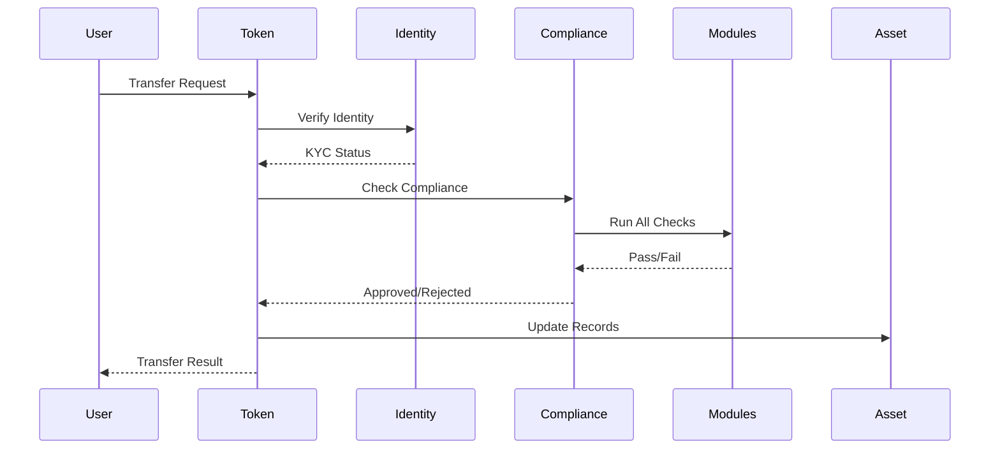

# Finatrades RWA Smart Contracts

## Table of Contents
- [Executive Summary](#executive-summary)
- [Architecture Overview](#architecture-overview)
- [Deployed Contracts](#deployed-contracts)
- [Contract Details](#contract-details)
- [ABI Locations](#abi-locations)
- [Integration Guide](#integration-guide)
- [Security Architecture](#security-architecture)
- [Compliance Flow](#compliance-flow)
- [Development Setup](#development-setup)
- [Testing](#testing)
- [Audit Considerations](#audit-considerations)

## Executive Summary

**Finatrades** is pioneering the tokenization of Real World Assets (RWAs) through a comprehensive ERC-3643 compliant security token system. Our platform enables institutions to tokenize any asset class—from real estate and commodities to art and intellectual property—while maintaining full regulatory compliance.

### Key Features
- **ERC-3643 (T-REX) Compliant**: Full implementation of the Token for Regulated EXchanges standard
- **Multi-Asset Support**: Universal registry supporting any type of RWA
- **Modular Compliance**: Pluggable compliance modules for different jurisdictions
- **Identity Management**: On-chain KYC/AML with privacy preservation
- **Regulatory Reporting**: Automated compliance reporting and monitoring
- **Upgradeability**: UUPS proxy pattern for future enhancements

### Technical Stack
- **Blockchain**: Polygon Mainnet (Chain ID: 137)
- **Solidity Version**: 0.8.19
- **Framework**: Hardhat
- **Standards**: ERC-3643, ERC-20, ERC-1967 (UUPS)
- **Dependencies**: OpenZeppelin 4.9.0

## Architecture Overview

```
┌─────────────────────────────────────────────────────────────────────────────┐
│                           Finatrades RWA Ecosystem                           │
└─────────────────────────────────────────────────────────────────────────────┘
                                        │
        ┌───────────────────────────────┴────────────────────────────────┐
        │                                                                 │
┌───────▼──────────┐                                          ┌──────────▼─────────┐
│  Security Token  │                                          │   Asset Registry   │
│  (ERC-3643)      │◄─────────────────────────────────────────┤   (Universal RWA)  │
└──────┬───────────┘                                          └────────────────────┘
       │                                                                 
       ├──────────────┬────────────────┬─────────────────┬──────────────┐
       │              │                │                 │              │
┌──────▼──────┐ ┌─────▼──────┐ ┌──────▼──────┐ ┌───────▼──────┐ ┌─────▼───────┐
│  Identity    │ │ Compliance │ │  Modules    │ │  Regulatory  │ │  Timelock   │
│  Registry    │ │  Engine    │ │  (3 Types) │ │  Reporting   │ │  Governance │
└─────────────┘ └────────────┘ └─────────────┘ └──────────────┘ └─────────────┘
```

### System Flow



## Deployed Contracts

### Polygon Mainnet Deployment (July 21, 2025)

#### Main Contracts (Proxy Addresses - Use These for Integration)

| Contract | Proxy Address | Implementation | Purpose |
|----------|---------------|----------------|---------|
| **Token** | [`0xED1c85A48EcD10654eD075F63F554cB3ac7faf6c`](https://polygonscan.com/address/0xED1c85A48EcD10654eD075F63F554cB3ac7faf6c) | `0x8C5DA9118B70A23b01451Bc6f0baEc9A41Aa6A12` | ERC-3643 Security Token |
| **IdentityRegistry** | [`0x25150414235289c688473340548698B5764651E3`](https://polygonscan.com/address/0x25150414235289c688473340548698B5764651E3) | `0x0BD1A2EdF1FCd608fC0537f6268E2b9c565a58B8` | KYC/Identity Management |
| **ModularCompliance** | [`0x123A014c135417b58BB3e04A5711C8F126cA95E8`](https://polygonscan.com/address/0x123A014c135417b58BB3e04A5711C8F126cA95E8) | `0xca244a40FEd494075195b9632c75377ccFB7C8ff` | Compliance Orchestration |
| **AssetRegistry** | [`0x4717bED7008bc5aF62b3b91a29aaa24Bab034038`](https://polygonscan.com/address/0x4717bED7008bc5aF62b3b91a29aaa24Bab034038) | `0xBe125EFCBCeB60EC5Bf38e00158999E8Eb359347` | RWA Asset Management |
| **RegulatoryReporting** | [`0xcd5fC2E20D697394d66e30475981bA5F37fD160e`](https://polygonscan.com/address/0xcd5fC2E20D697394d66e30475981bA5F37fD160e) | `0xe4da869B9C55120aeAFc3c1e21d2C413531F18B2` | Compliance Reporting |

#### Supporting Contracts

| Contract | Proxy Address | Implementation | Purpose |
|----------|---------------|----------------|---------|
| **ClaimTopicsRegistry** | [`0x6Ec58c34DF899Ff9d67FD088Cd339bB75508Dd79`](https://polygonscan.com/address/0x6Ec58c34DF899Ff9d67FD088Cd339bB75508Dd79) | `0x2DEF12D0C8448DD8866AcFD839aDbFE07b5C7A15` | Identity Claim Topics |
| **CountryRestrictModule** | [`0x934b1C1AD4d205517B1a09A984c3F077cd99651A`](https://polygonscan.com/address/0x934b1C1AD4d205517B1a09A984c3F077cd99651A) | `0xb9a74E93E9Ee80C083F256fbCA24929fF48cab60` | Geographic Restrictions |
| **MaxBalanceModule** | [`0x77B6c7aBB74653F1F48ac6Ebd1154532D13c41b3`](https://polygonscan.com/address/0x77B6c7aBB74653F1F48ac6Ebd1154532D13c41b3) | `0xcab5474536C676b62e6bF1aDeb48CE0092c62d00` | Balance Limits |
| **TransferLimitModule** | [`0x6887c6c45B64C6E6D55dFADb2a4857C5DAD63D57`](https://polygonscan.com/address/0x6887c6c45B64C6E6D55dFADb2a4857C5DAD63D57) | `0x9fF75c5cE984849224a865f44e0d5bE9BeA12e0A` | Transfer Limits |
| **FinatradesTimelock** | [`0xf98Ee2EE41Ee008AEc3A17a87E06Aa0Dc4Cd38e4`](https://polygonscan.com/address/0xf98Ee2EE41Ee008AEc3A17a87E06Aa0Dc4Cd38e4) | N/A (Non-upgradeable) | 48-hour Governance Delay |

### Deployment Information
- **Network**: Polygon Mainnet (Chain ID: 137)
- **Deployer**: `0xCE982AC6bc316Cf9d875652B84C7626B62a899eA`
- **Deployment Date**: July 21, 2025
- **Total Gas Cost**: ~2.5 MATIC
- **Verification Status**: All contracts verified on Polygonscan ✅

## Contract Details

### 1. Token Contract (ERC-3643 Security Token)
**Address**: `0xED1c85A48EcD10654eD075F63F554cB3ac7faf6c`

The main security token implementing the ERC-3643 standard with additional features:

```solidity
// Key Functions
function transfer(address to, uint256 amount) // Compliance-checked transfer
function mint(address account, uint256 amount) // Restricted minting
function burn(address account, uint256 amount) // Token burning
function freeze(address account) // Freeze investor account
function freezePartialTokens(address account, uint256 amount) // Freeze specific amount
function setIdentityRegistry(address _identityRegistry) // Update identity registry
function setCompliance(address _compliance) // Update compliance contract
function recoveryAddress(address lostWallet, address newWallet) // Recover lost tokens
```

**Access Control Roles**:
- `OWNER_ROLE`: Full administrative control
- `AGENT_ROLE`: Mint, burn, freeze operations
- `UPGRADER_ROLE`: Contract upgrade authorization

### 2. IdentityRegistry
**Address**: `0x25150414235289c688473340548698B5764651E3`

Manages on-chain identities and KYC verification:

```solidity
// Key Functions
function registerIdentity(address _userAddress, address _identity, uint16 _country)
function updateIdentity(address _userAddress, address _identity)
function updateCountry(address _userAddress, uint16 _country)
function deleteIdentity(address _userAddress)
function isVerified(address _userAddress) returns (bool)
function identity(address _userAddress) returns (address)
```

### 3. ModularCompliance
**Address**: `0x123A014c135417b58BB3e04A5711C8F126cA95E8`

Orchestrates compliance rules through pluggable modules:

```solidity
// Key Functions
function bindToken(address _token)
function addModule(address _module)
function removeModule(address _module)
function isTransferValid(address _from, address _to, uint256 _amount) returns (bool)
function transferred(address _from, address _to, uint256 _amount)
function getModules() returns (address[])
```

### 4. AssetRegistry
**Address**: `0x4717bED7008bc5aF62b3b91a29aaa24Bab034038`

Universal registry for any type of Real World Asset:

```solidity
// Key Functions
function registerAsset(
    bytes32 assetId,
    string memory name,
    AssetCategory category,
    uint256 valuationAmount,
    string memory metadataURI,
    address custodian
)
function setTextAttribute(bytes32 assetId, string memory key, string memory value)
function setNumericAttribute(bytes32 assetId, string memory key, uint256 value)
function setBooleanAttribute(bytes32 assetId, string memory key, bool value)
function setAddressAttribute(bytes32 assetId, string memory key, address value)
function updateAssetValuation(bytes32 assetId, uint256 newValuation, string memory source)
function createRevenueStream(bytes32 assetId, uint256 amount, uint256 frequency, address collector)
```

**Asset Categories**:
- REAL_ESTATE
- COMMODITIES
- ART_COLLECTIBLES
- INTELLECTUAL_PROPERTY
- FINANCIAL_INSTRUMENTS
- INFRASTRUCTURE
- NATURAL_RESOURCES
- OTHER

### 5. Compliance Modules

#### CountryRestrictModule
**Address**: `0x934b1C1AD4d205517B1a09A984c3F077cd99651A`

```solidity
function addCountryRestriction(uint16 _country)
function removeCountryRestriction(uint16 _country)
function batchRestrictCountries(uint16[] calldata _countries)
function isTransferAllowed(address _from, address _to, uint256 _amount) returns (bool)
```

#### MaxBalanceModule
**Address**: `0x77B6c7aBB74653F1F48ac6Ebd1154532D13c41b3`

```solidity
function setDefaultMaxBalance(uint256 _defaultMax)
function setMaxBalance(address _user, uint256 _max)
function batchSetMaxBalance(address[] calldata _users, uint256[] calldata _maxBalances)
function getMaxBalance(address _user) returns (uint256)
```

#### TransferLimitModule
**Address**: `0x6887c6c45B64C6E6D55dFADb2a4857C5DAD63D57`

```solidity
function setDefaultLimits(uint256 _dailyLimit, uint256 _monthlyLimit)
function setTransferLimit(address _user, uint256 _dailyLimit, uint256 _monthlyLimit)
function getTransferStats(address _user) returns (uint256 dailyTransferred, uint256 monthlyTransferred)
```

### 6. RegulatoryReporting
**Address**: `0xcd5fC2E20D697394d66e30475981bA5F37fD160e`

Automated regulatory reporting and compliance monitoring:

```solidity
// Key Functions
function generateTransferReport(uint256 fromTimestamp, uint256 toTimestamp)
function getHolderCount() returns (uint256)
function getHolderList(uint256 offset, uint256 limit) returns (address[])
function getComplianceViolations(address investor) returns (uint256)
function generateComplianceReport() returns (bytes)
```

## ABI Locations

All contract ABIs are located in the `artifacts/contracts/` directory:

```
artifacts/contracts/
├── token/
│   └── Token.sol/
│       └── Token.json                    # Main token ABI
├── registry/
│   ├── IdentityRegistry.sol/
│   │   └── IdentityRegistry.json         # Identity registry ABI
│   ├── ClaimTopicsRegistry.sol/
│   │   └── ClaimTopicsRegistry.json      # Claim topics ABI
│   └── AssetRegistry.sol/
│       └── AssetRegistry.json            # Asset registry ABI
├── compliance/
│   ├── ModularCompliance.sol/
│   │   └── ModularCompliance.json        # Compliance engine ABI
│   └── modular/
│       ├── CountryRestrictModule.sol/
│       │   └── CountryRestrictModule.json
│       ├── MaxBalanceModule.sol/
│       │   └── MaxBalanceModule.json
│       └── TransferLimitModule.sol/
│           └── TransferLimitModule.json
├── reporting/
│   └── RegulatoryReportingOptimized.sol/
│       └── RegulatoryReportingOptimized.json
└── governance/
    └── FinatradesTimelock.sol/
        └── FinatradesTimelock.json
```

### Loading ABIs in JavaScript/TypeScript

```javascript
// Example: Loading Token ABI
const TokenABI = require('./artifacts/contracts/token/Token.sol/Token.json').abi;

// Using with ethers.js
const token = new ethers.Contract(
    '0xED1c85A48EcD10654eD075F63F554cB3ac7faf6c',
    TokenABI,
    signer
);

// Using with web3.js
const token = new web3.eth.Contract(
    TokenABI,
    '0xED1c85A48EcD10654eD075F63F554cB3ac7faf6c'
);
```

## Integration Guide

### 1. Setting Up Identity (KYC/AML)

```javascript
// Deploy identity contract for investor
const Identity = await ethers.getContractFactory("Identity");
const identity = await Identity.deploy(investorAddress);

// Register in IdentityRegistry
const identityRegistry = await ethers.getContractAt(
    "IdentityRegistry",
    "0x25150414235289c688473340548698B5764651E3"
);

await identityRegistry.registerIdentity(
    investorAddress,
    identity.address,
    840 // USA country code
);

// Add required claims
await identity.addClaim(
    7, // KYC claim topic
    1, // Scheme
    issuerAddress,
    signature,
    data,
    uri
);
```

### 2. Minting Tokens

```javascript
const token = await ethers.getContractAt(
    "Token",
    "0xED1c85A48EcD10654eD075F63F554cB3ac7faf6c"
);

// Only AGENT_ROLE can mint
await token.mint(investorAddress, ethers.parseEther("1000"));
```

### 3. Configuring Compliance Rules

```javascript
const compliance = await ethers.getContractAt(
    "ModularCompliance",
    "0x123A014c135417b58BB3e04A5711C8F126cA95E8"
);

// Add compliance modules
await compliance.addModule("0x934b1C1AD4d205517B1a09A984c3F077cd99651A"); // Country restrict
await compliance.addModule("0x77B6c7aBB74653F1F48ac6Ebd1154532D13c41b3"); // Max balance
await compliance.addModule("0x6887c6c45B64C6E6D55dFADb2a4857C5DAD63D57"); // Transfer limit

// Configure country restrictions
const countryModule = await ethers.getContractAt(
    "CountryRestrictModule",
    "0x934b1C1AD4d205517B1a09A984c3F077cd99651A"
);
await countryModule.batchRestrictCountries([850, 408]); // Block Virgin Islands, North Korea
```

### 4. Registering Assets

```javascript
const assetRegistry = await ethers.getContractAt(
    "AssetRegistry",
    "0x4717bED7008bc5aF62b3b91a29aaa24Bab034038"
);

// Register a real estate asset
const assetId = ethers.id("PROPERTY-001");
await assetRegistry.registerAsset(
    assetId,
    "Manhattan Commercial Building",
    0, // REAL_ESTATE category
    100000000, // $100M valuation
    "ipfs://QmAssetMetadata",
    custodianAddress
);

// Set asset attributes
await assetRegistry.setTextAttribute(assetId, "address", "123 Wall St, NYC");
await assetRegistry.setNumericAttribute(assetId, "sqft", 50000);
await assetRegistry.setNumericAttribute(assetId, "yearBuilt", 1985);
await assetRegistry.setBooleanAttribute(assetId, "leased", true);
```

## Security Architecture

### 1. Access Control Matrix

| Contract | Role | Permissions |
|----------|------|-------------|
| **Token** | OWNER_ROLE | All admin functions, role management |
| | AGENT_ROLE | Mint, burn, freeze, forced transfers |
| | UPGRADER_ROLE | Authorize upgrades |
| **IdentityRegistry** | OWNER_ROLE | All functions |
| | IDENTITY_REGISTRAR_ROLE | Register/update identities |
| | AGENT_ROLE | Read functions only |
| **AssetRegistry** | ASSET_MANAGER_ROLE | Register/update assets |
| | AUDITOR_ROLE | Read all asset data |
| **ModularCompliance** | OWNER_ROLE | Add/remove modules, bind token |

### 2. Emergency Controls

- **Pause Mechanism**: All critical contracts can be paused
- **Token Recovery**: Lost tokens can be recovered with proper authorization
- **Freezing**: Individual accounts or specific amounts can be frozen
- **Timelock**: 48-hour delay for governance actions

### 3. Upgrade Security

All upgradeable contracts use the UUPS pattern with:
- Separate UPGRADER_ROLE required for upgrades
- Storage gap for future variables
- Initializer protection against re-initialization

## Compliance Flow

```
Transfer Request → Identity Check → Compliance Modules → Transfer Execution
                        ↓                    ↓
                   [FAIL: Reject]      [Module Checks]
                                            ↓
                                    ┌───────────────┐
                                    │ Country Check │
                                    │ Balance Check │
                                    │ Limit Check   │
                                    └───────────────┘
                                            ↓
                                    [ALL PASS: Execute]
```

### Compliance Module Execution

1. **Pre-Transfer**: All modules must return `true` for transfer approval
2. **Post-Transfer**: Modules update their internal state (e.g., transfer counters)
3. **Atomic**: If any module fails, entire transfer is reverted

## Support and Resources

### Official Channels
- **Website**: https://finatrades.com
- **Support & Security**: blockchain@finatrades.com

### Repository Structure

```
rwa_contracts/
├── contracts/           # Solidity contracts
├── scripts/            # Deployment scripts
├── test/              # Test files
├── artifacts/         # Compiled contracts and ABIs
├── deployments/       # Deployment addresses
├── docs/             # Additional documentation
└── audits/           # Audit reports
```

### License

MIT License - Copyright (c) 2025 Finatrades

---

**Deployment Date**: July 21, 2025  
**Network**: Polygon Mainnet  
**Version**: 1.2.0